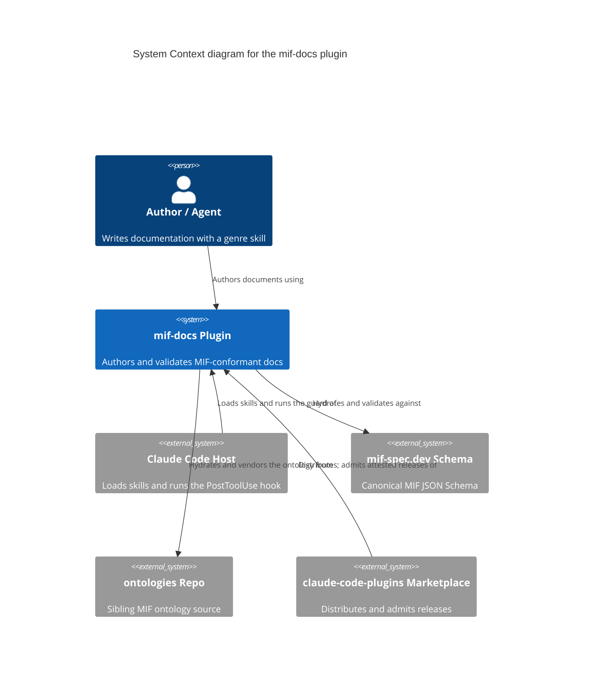
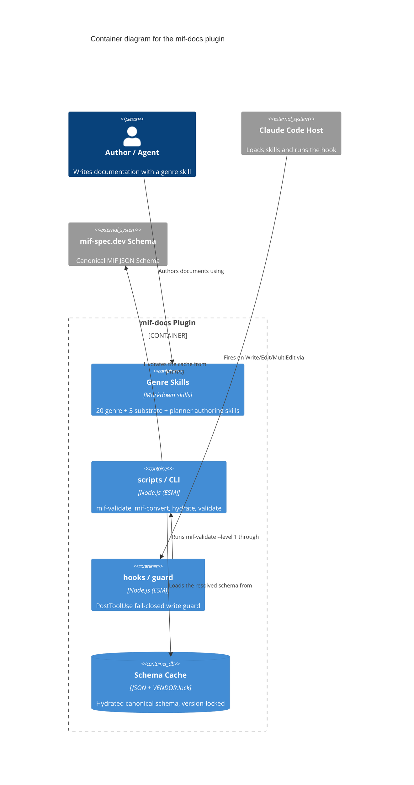
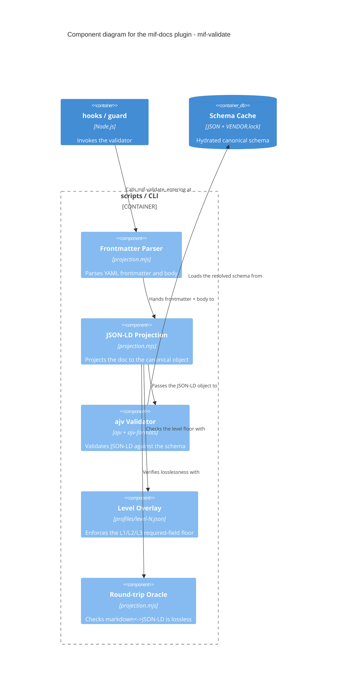

# mif-docs Plugin — C4 Model

This model describes the mif-docs Claude Code plugin at three C4 levels of
abstraction. Each diagram zooms in one level; the Code level (Level 4) is
deliberately omitted. The element catalogs below each diagram are the durable
record — the diagrams are one Mermaid rendering of those abstractions.

## Level 1 — System Context

How the mif-docs plugin fits into the world: who uses it and which other systems
it depends on.

| Element | Kind | Responsibility |
| --- | --- | --- |
| Author / Agent | person | Selects a genre skill and authors a document. |
| mif-docs Plugin | system (in scope) | Authors MIF docs and proves their conformance. |
| Claude Code Host | external system | Loads the plugin's skills and runs its hook. |
| mif-spec.dev Schema | external system | Authoritative MIF JSON Schema for validation. |
| ontologies Repo | external system | Source of the MIF ontology vocabulary. |
| claude-code-plugins Marketplace | external system | Distributes the plugin; gates admission on attestation. |

## Level 2 — Container

Zooming into the mif-docs plugin to show its deployable/runnable containers and
how they communicate.

| Element | Kind | Responsibility |
| --- | --- | --- |
| Genre Skills | container | Author MIF documents, one skill per genre. |
| scripts / CLI | container | Deterministic projection, validation, and hydration tools. |
| hooks / guard | container | Blocks non-conformant genre writes at the L1 floor. |
| Schema Cache | container (datastore) | Holds the hydrated schema plus `VENDOR.lock`. |
| mif-spec.dev Schema | external system | Source the cache hydrates from over HTTPS. |

## Level 3 — Component

Zooming into the **scripts / CLI** container to show the components of
`mif-validate`. The container name matches the Level 2 diagram exactly.

| Element | Kind | Responsibility |
| --- | --- | --- |
| Frontmatter Parser | component | Splits the document into YAML frontmatter and body. |
| JSON-LD Projection | component | Maps frontmatter + body to the canonical JSON-LD object. |
| ajv Validator | component | Schema-checks the JSON-LD against the hydrated schema. |
| Level Overlay | component | Applies the required-field floor for the requested level. |
| Round-trip Oracle | component | Confirms the markdown↔JSON-LD round-trip loses nothing. |

## Notes

- Level 4 (Code) is intentionally omitted: it ages quickly and is better
  generated on demand from the IDE.
- Every relationship is labelled with intent and, where it matters, protocol.
- Technology tags sit on containers and components only — never on people or
  external systems.
- This C4 model is the kind of artifact the plugin's **arc42** architecture
  document embeds in its §3 *Context and Scope* (Level 1) and §5 *Building Block
  View* (Levels 2–3) sections — the `relates-to` relationship in the frontmatter
  records that genre-level link to `arch-arc42-mif-docs`.
