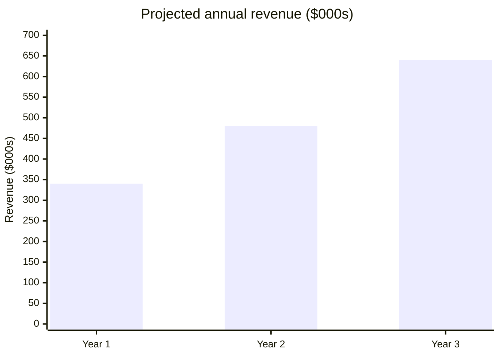
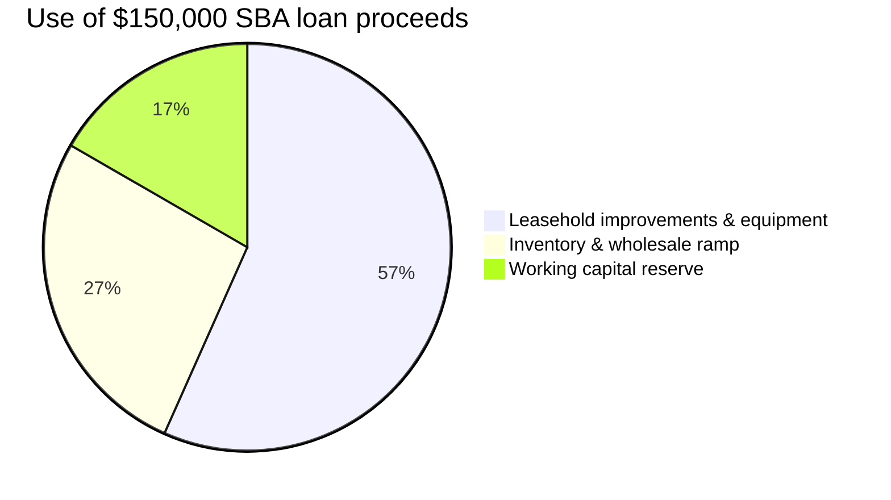

# Business Plan: Meridian Cold-Brew Coffee Co. — Second Location & Wholesale Expansion (2026)

Prepared for an SBA 7(a) loan application. Meridian Cold-Brew Coffee Co. is a
single-location cold-brew cafe and micro-roastery in Portland, OR, seeking
$150,000 in financing to open a second retail location and launch a
wholesale line to independent grocers.

## Executive Summary

Meridian Cold-Brew Coffee Co. is a Portland, OR cold-brew cafe and
micro-roastery, LLC, founded 2024. In its first full year of trading
(2025), Meridian generated $310,000 in revenue at a 58% gross margin, with
quarter-over-quarter gross-margin growth of roughly 3 points per quarter as
batch-brewing efficiency improved. Meridian requests $150,000 in SBA 7(a)
financing to open a second retail location in the Hawthorne district and
launch a wholesale cold-brew line sold to independent grocers, projected to
grow total revenue to $640,000 by the end of year 3 of the loan term.

## Company Description

Meridian Cold-Brew Coffee Co., LLC was formed in Oregon in March 2024 and
is wholly owned by its two founders. The company exists to solve a specific
problem in Portland's coffee market: cold-brew drinkers currently choose
between mass-market bottled cold-brew (convenient, low quality) and
full-service cafes (high quality, slow, expensive) with nothing serving
grab-and-go demand at a mid-price, high-quality point. Meridian's solution
is a small-footprint, fast-service cold-brew bar built around a proprietary
18-hour slow-extraction batch process, paired with a retail micro-roastery
that supplies its own beans.

## Products & Services

Meridian sells ready-to-drink cold-brew (single-origin and house-blend),
bagged whole-bean coffee roasted on-site, and a small food-pairing menu.
Retail pricing for a 16oz cold-brew is $5.25, in line with the mid-price
positioning described above. The company's unique value proposition is
"cafe-quality cold-brew at grab-and-go speed" — no other Portland cold-brew
concept currently pairs an 18-hour slow-extraction process with a
sub-90-second service time.

## Market Analysis

The U.S. ready-to-drink coffee segment, which includes cold-brew, has grown
faster than total coffee-category sales for the past several years as
younger consumers shift toward cold and convenience formats; Meridian's
target customer is the 22-40 age cohort within a 2-mile radius of each
location, a segment that indexes heavily toward cold-brew over hot coffee
in Portland foot-traffic studies the company has reviewed informally.
Meridian treats this as a directional market signal, not a precisely sized
local total addressable market, and will commission or gather more specific
local sizing data before finalizing site selection for any location beyond
the second.

## Competitive Analysis

Meridian's competitors fall into two groups: national cold-brew bottlers
sold in grocery (convenient, lower quality, no local brand affinity) and
full-service Portland cafes that offer cold-brew as a menu item rather than
a core product (higher quality perception, slower service, higher price).
Meridian's unfair advantage is its proprietary 18-hour extraction process
combined with on-site roasting, which neither competitor group replicates:
bottlers cannot match freshness and cafes are not optimized for cold-brew
throughput.

## Marketing & Sales Strategy

Meridian's positioning is "cafe-quality, grab-and-go speed." Primary
channels are walk-in retail at both locations, a wholesale line to 6-10
independent Portland grocers in year 1 of the expansion, and a loyalty app
already in use at the first location with roughly 1,400 active members.
Pricing holds at the current mid-price point; wholesale pricing is set at a
40% discount to retail with a $500 minimum order.

## Operations Plan

The second location (Hawthorne district, lease under negotiation) will
mirror the first location's build-out: a 900 sq ft footprint, the same
batch-brewing equipment vendor, and the same supplier relationships for
green coffee. Wholesale production runs out of the existing roastery
facility, which has confirmed spare batch capacity for the first 10
wholesale accounts without additional equipment.

## Management & Organization

Meridian is managed by its two founders: one leads operations and roasting
(prior 6 years as a roaster at a regional Portland coffee company), the
other leads finance and wholesale sales (prior 4 years in CPG sales). The
second location adds a location manager and 4 part-time baristas; wholesale
adds one part-time route-delivery driver.

## Financial Plan & Projections

**Assumptions.** Retail unit price: $5.25/cup, average per-location daily
volume ramping from 120 to 220 cups/day over 18 months post-open. Wholesale
unit price: $6.30/bottle (40% off a $10.50 comparable retail bottle price),
ramping from 6 to 10 grocer accounts over year 1 of the expansion at an
average 40 units/week/account. Cost basis: 34% COGS on retail, 42% COGS on
wholesale (lower margin, higher volume). Fixed costs: $9,200/month for the
new location (rent, utilities, base staffing) once opened.

**Year 1** (monthly detail, opening month 2 of the loan term): revenue
ramps from roughly $18,000/month (existing location only) to $34,000/month
by month 12 as the second location and wholesale line ramp in. Year-1
total: approximately $340,000.

**Year 2** (quarterly detail): revenue grows to approximately $480,000 as
both channels reach steady-state volumes assumed above.

**Year 3** (annual): revenue reaches approximately $640,000 as wholesale
accounts grow from 10 to an assumed 16 based on the year-2 sales
relationship pace; this year-3 figure is a lower-confidence extrapolation
of the year-1/2 sales-pace assumption, not a comparable-company benchmark,
and is flagged as such.

**Break-even.** At the assumed cost structure, the second location reaches
monthly break-even at approximately 165 cups/day, projected in month 7
post-open.

**Cash flow and balance sheet.** Full monthly cash-flow and balance-sheet
schedules are provided in the Appendix; the loan is modeled as a 10-year
SBA 7(a) term note at the current published SBA base rate at time of
application.

## Funding Request

Meridian requests **$150,000** in SBA 7(a) financing. Use of funds:
$85,000 leasehold improvements and equipment for the second location,
$40,000 initial inventory and wholesale production ramp, $25,000 working
capital reserve. Terms sought: 10-year term, standard SBA 7(a) guarantee
structure, first available closing.

## Appendix

Detailed monthly cash-flow schedule (months 1-36), balance sheet
projections, founder resumes, existing-location 2025 financial statements,
and the Hawthorne lease letter of intent are attached to the full loan
application package and available on request.

### Sources

1. U.S. Small Business Administration — Write your business plan, <https://www.sba.gov/business-guide/plan-your-business/write-your-business-plan>
2. SCORE — Financial Projections Template, <https://www.score.org/resource/template/financial-projections-template>

<!--
MIF Level 1 (floor): id, type, created + body. A complete, valid business
plan — but opaque to a machine consumer. It cannot be queried for "is this
financial model still current?", "where did this market claim come from?",
or "what related PRD or market study does this connect to?". Compare
templates/good.md (full L3: temporal validity, W3C-PROV provenance,
per-claim citations, typed relationships). Gate: mif-validate --level 1.
-->
