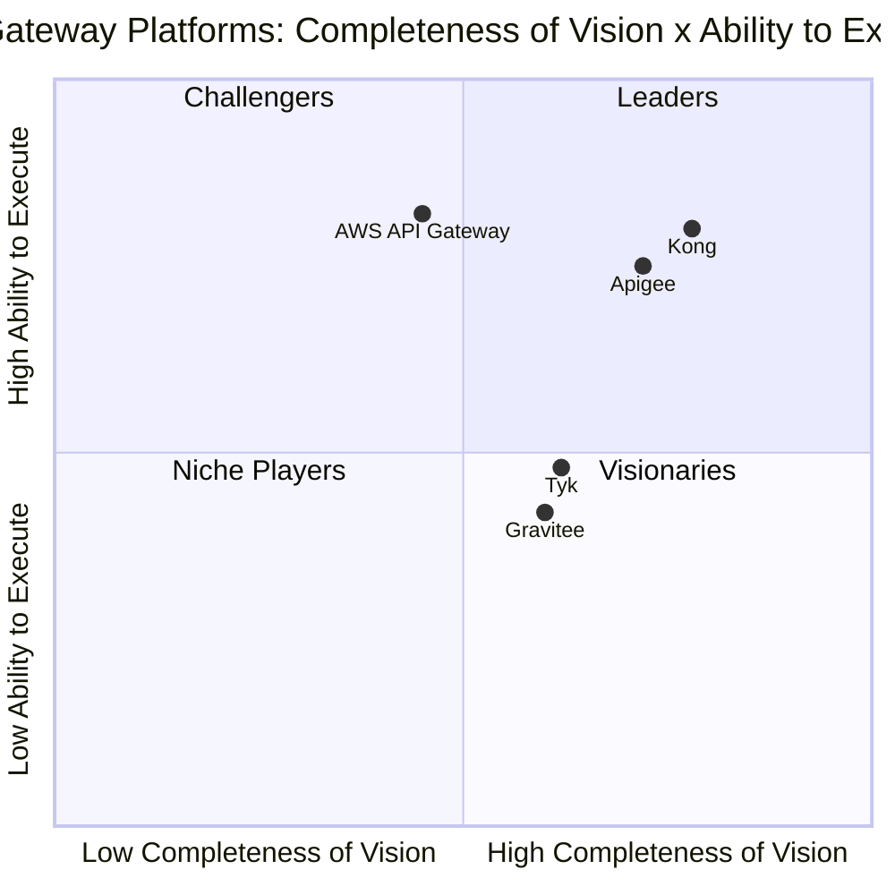

# Competitive Quadrant: Full Lifecycle API Gateway Platforms

This report is a generic two-axis competitive analysis. **It is not a Gartner
Magic Quadrant.** "Magic Quadrant" is a Gartner trademark and a proprietary
methodology; this report reproduces only a generic Completeness of Vision x
Ability to Execute structure and implies no Gartner endorsement.

As-of date of vendor evidence: 2026-06-26.

## Market Definition / Inclusion Criteria

The market evaluated is **full lifecycle API gateway platforms**: products
that accept inbound API traffic, enforce policy (auth, rate limiting,
transformation), and route it to backend services, with a management plane for
defining and versioning those policies.

A vendor is included only if it satisfies all of the following:

- Ships a request-routing gateway data plane plus a separate policy/management
  plane (excludes bare reverse proxies with no management layer).
- Is generally available today as either a self-hosted product or a managed
  cloud service.
- Publishes public product documentation an evaluator can independently
  verify.

Five vendors met all three criteria and are included: **Kong**, **Apigee**,
**AWS API Gateway**, **Tyk**, and **Gravitee**.

## Two-axis evaluation

Vendors are scored on two axes:

- **Completeness of Vision (x-axis)** — breadth of the API lifecycle covered
  (design, gateway, analytics, monetization, event-native/streaming support)
  and openness of the deployment model (self-hosted, hybrid, multi-cloud vs.
  single-cloud-only).
- **Ability to Execute (y-axis)** — production-readiness of the managed
  offering, depth of first-party ecosystem integration, and operational
  simplicity of running the gateway at scale.

| Vendor | Completeness of Vision | Ability to Execute |
| --- | --- | --- |
| Kong | High — open-source core plus a plugin architecture spanning gateway, service mesh, and API management, deployable self-hosted, hybrid, or multi-cloud [1] | High — mature managed Konnect offering with broad plugin ecosystem |
| Apigee | High — full API lifecycle (design, gateway, analytics, monetization) [2] | High — Google Cloud-managed, strong ops maturity, but effectively single-cloud |
| AWS API Gateway | Medium — gateway plus usage plans and throttling, no built-in monetization or multi-cloud story [3] | High — fully managed, deep native integration with Lambda and IAM |
| Tyk | Medium-High — open-source gateway with GraphQL federation support, self-hosted or cloud [4] | Medium — smaller ecosystem, lighter operational footprint |
| Gravitee | Medium-High — open source, strong event-native/streaming (Kafka) gateway support [5] | Medium — growing managed-cloud maturity, smaller install base than incumbents |

## Vendor profiles

### Kong

#### Strengths

- Single plugin architecture spans gateway, service mesh, and full API
  management, reducing tooling sprawl [1].
- Deployable self-hosted, hybrid, or fully managed (Konnect), avoiding
  single-cloud lock-in [1].

#### Cautions

- The open-source core and the enterprise/Konnect feature set diverge; some
  capabilities require the commercial tier [1].

### Apigee

#### Strengths

- Covers the full API lifecycle in one product: design, gateway, analytics,
  and monetization [2].
- Deep integration with the surrounding Google Cloud ecosystem (IAM, Cloud
  Logging, Cloud Monitoring) [2].

#### Cautions

- Effectively a single-cloud offering; running it outside Google Cloud is not
  the primary supported path [2].

### AWS API Gateway

#### Strengths

- Fully managed with no gateway infrastructure to operate; scales
  automatically with the account's configured throttling limits [3].
- Native, low-friction integration with AWS Lambda and IAM for
  request-level authorization [3].

#### Cautions

- No built-in monetization or multi-cloud deployment path; the product is
  scoped to the AWS ecosystem [3].

### Tyk

#### Strengths

- Open-source core with a lighter operational footprint than the larger
  incumbents [4].
- Native GraphQL federation support alongside REST [4].

#### Cautions

- Smaller plugin and integration ecosystem than Kong or Apigee [4].

### Gravitee

#### Strengths

- Open source with strong event-native and streaming-API (Kafka) gateway
  support, ahead of most REST-first competitors on this axis [5].

#### Cautions

- Smaller production install base and less mature managed-cloud tooling than
  the market's incumbents [5].

## Quadrant placement

- **Leaders**: Kong, Apigee — highest on both axes: broad lifecycle coverage,
  flexible deployment, and mature managed execution.
- **Challengers**: AWS API Gateway — strong execution and reliability, but
  narrower vision (no monetization, single-cloud-scoped).
- **Visionaries**: none placed this cycle — no included vendor combined high
  vision with materially lower execution maturity.
- **Niche Players**: Tyk, Gravitee — meaningful vision on specific axes
  (GraphQL federation; event-native streaming) with smaller execution scale
  than the Leaders.

## Context & Market Overview

The API gateway market continues to bifurcate between REST-first incumbents
extending into full lifecycle management (Kong, Apigee) and cloud-native
managed offerings tied to a single hyperscaler (AWS API Gateway). Event-native
and streaming-API support (Gravitee) and GraphQL federation (Tyk) are emerging
differentiators rather than table-stakes, which is why no vendor in this
inclusion set currently lands in Visionaries.

## Methodology

Vendor evidence was gathered from each vendor's own public product
documentation, current as of 2026-06-26. Axis scores are the evaluator's
qualitative judgment against the stated Completeness of Vision and Ability to
Execute sub-criteria; no vendor claim was independently benchmarked. All five
findings underlying this report were treated as settled, verifiable product
documentation; none were flagged as contested or preliminary. Limits: this
report evaluates only vendors meeting the stated inclusion criteria as of the
as-of date, and does not assess pricing.

## References

1. Kong Gateway documentation — <https://docs.konghq.com/>
2. Apigee documentation — <https://cloud.google.com/apigee/docs>
3. Amazon API Gateway documentation — <https://docs.aws.amazon.com/apigateway/>
4. Tyk documentation — <https://tyk.io/docs/>
5. Gravitee documentation — <https://documentation.gravitee.io/>
